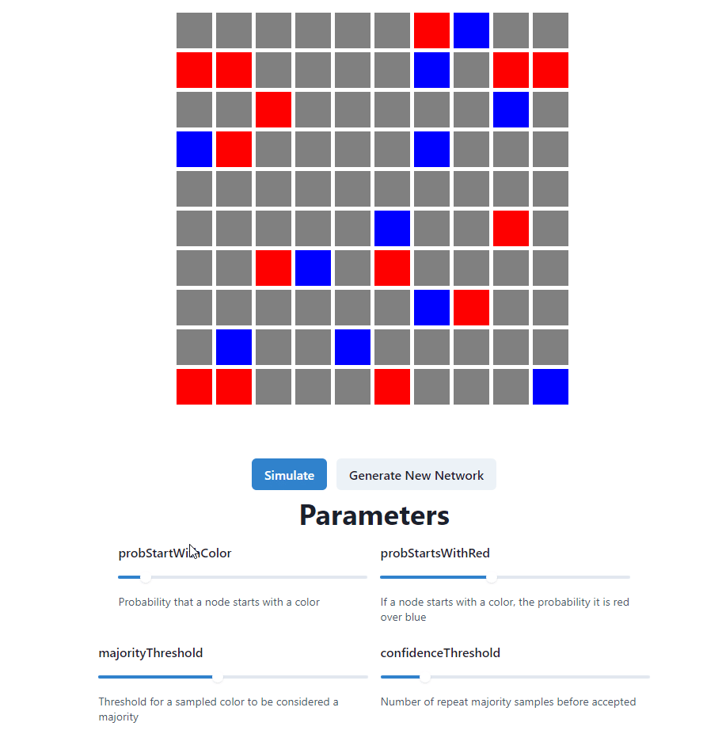

# Snowball Visualization

Visualizes Snowball binary consensus with nodes on an html5 canvas & customizable parameters

Uses React & React-Konva

# Run Locally

Clone the repository, run `npm install`, then `npm start` to start a local development server.
